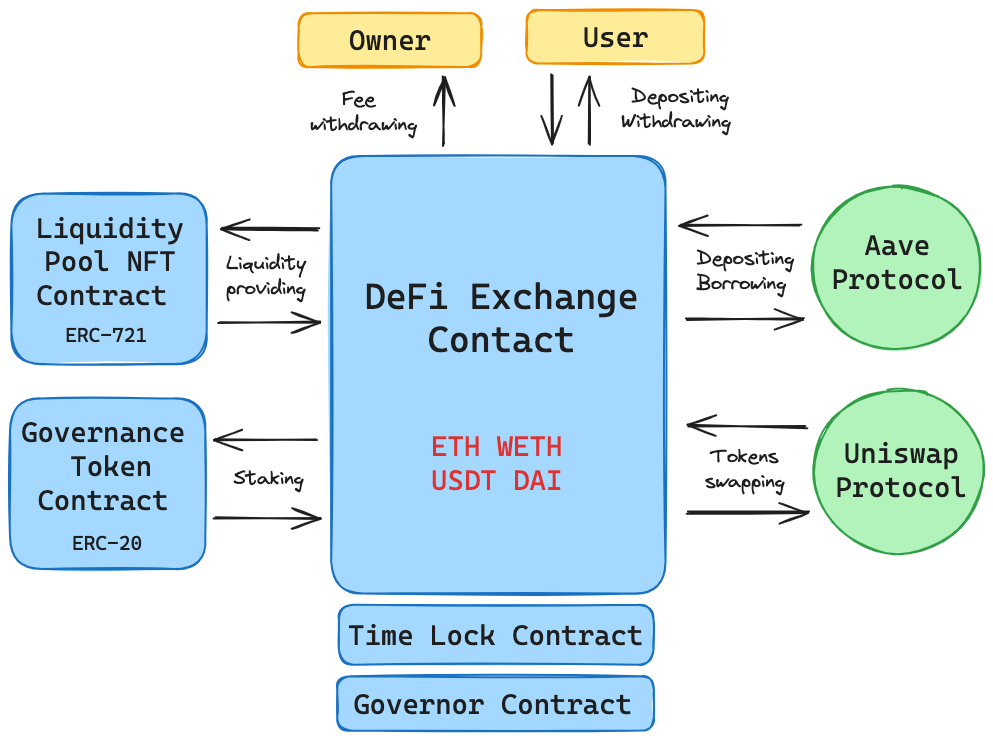

# DeFi Exchange DAO
Decentralized Finance Exchange Decentralized Autonomous Organization

[](https://app.circleci.com/pipelines/github/v7m/defi-exchange-dao-hardhat)

> *This is an educational project with the purpose of acquiring hands-on experience in web3 application development using smart contracts written in Solidity.*

## Description

The DeFi Exchange DAO is a multifaceted decentralized finance platform, offering a range of DeFi services and functionalities. It operates with a select group of cryptocurrencies, specifically Ethereum (`ETH`), `DAI`, `USDT`, and Wrapped Ethereum (`WETH`), providing users with various options for their DeFi transactions. Key features of the platform include:

- **Deposits and Withdrawals**: Users can deposit and withdraw `ETH`, `DAI`, `USDT`, and `WETH`, facilitating flexible asset management.
- **ETH Staking for Governance Token**s: The platform allows `ETH` staking, enabling users to earn governance tokens, which are instrumental in participating in the platform's decision-making processes.
- **Token Swapping via Uniswap**: Users can swap between `ETH`, `DAI`, `USDT`, and `WETH` using the integrated `Uniswap` protocol, enhancing trading efficiency and accessibility.
- **Interaction with Aave Protocol**: The platform integrates with `Aave`, allowing users to deposit and borrow the supported tokens, adding layers of utility and financial opportunities.
- **Liquidity Provision and NFT Rewards**: Providing liquidity with the supported tokens earns users unique Liquidity Pool NFTs, representing their stake, which can be redeemed back for the initial tokens.
- **Decentralized Governance**: Operating under a DAO structure, the platform empowers its users to vote on key proposals and platform updates using their governance tokens, ensuring a democratic and community-driven approach.

This platform is designed to be a comprehensive DeFi solution, particularly focusing on `ETH`, `DAI`, `USDT`, and `WETH`, to cater to a broad spectrum of decentralized finance activities.

## Technical description



Deployed on the `Polygon` blockchain for its cost-efficiency, the DeFi Exchange DAO platform is crafted using Solidity and employs OpenZeppelin contracts for robust security and standardization, incorporating `ERC20` and `ERC721` standards for token operations. The system integrates with `Aave` and `Uniswap` for diverse DeFi functionalities. It features DAO governance for decentralized decision-making and an upgradable contract architecture, ensuring long-term adaptability and resilience. The platform's reliability is further reinforced through extensive unit and integration testing of all smart contracts.

### Built with

- **Solidity**: Primary language for Ethereum smart contract development.
- **OpenZeppelin Contracts**: For secure, standard smart contract implementations.
- **Aave and Uniswap Protocols**: Integrated for a broad range of DeFi services.
- **Hardhat**: Ethereum development environment for deployment and testing.
- **Ethers.js**: A JavaScript library used to interact with Ethereum blockchain.
- **Polygon Blockchain**: Chosen for its high efficiency and reduced transaction costs.

## Smart contract addresses

- **DeFi Exchange Contract**: `0x`
- **Liquidity Pool NFT Contract**: `0x`
- **Governance Token Contract**: `0x`
- **Governor Contract**: `0x`
- **Time Lock Contract**: `0x`

# Getting Started

```bash
git clone https://github.com/v7m/defi-exchange-dao-hardhat
cd defi-exchange-dao-hardhat
yarn
```

# Usage

## Deploy

```bash
yarn hardhat deploy
```

## Testing

```bash
yarn hardhat test
```

## Coverage

```bash
yarn coverage
```

## Linting

```bash
yarn lint
```